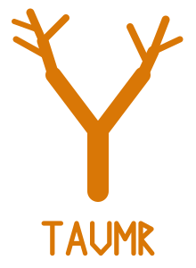

# taumr

Old Norse *taumr*: the rein. A shared harness and workflow for agentic coding.

This repo is a kit. Clone it somewhere like `~/dev/taumr`. Do not make it `~/.pi` or `~/.herdr`. Config files are not included; how you customize `~/.tmux.conf` and friends is up to you.

| here | on the machine |
| --- | --- |
| `.pi/agent/` | symlink or copy into `~/.pi/agent` |
| `herdr/` | merge fragments into `~/.config/herdr` |
| `skills/` | add the path in Pi settings, or symlink into `~/.agents/skills` |

Live secrets, sessions, models, sockets, and host paths stay local.

Pi, Herdr, tmux, and friends are tools we hitch. They are not this repo.
